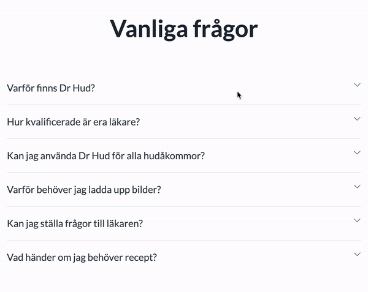
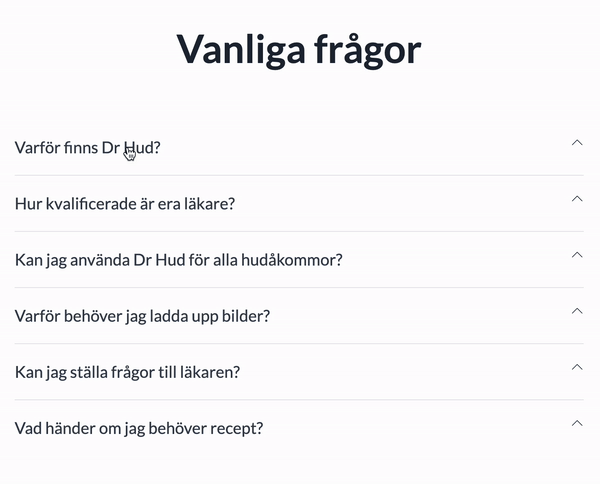

Hi there!

Firstly, thank you got taking the time to have a look!

Check it out [here!](https://drhud-faq.vercel.app/)

I noticed that with the faqs, they are quite snappy and thought it would be a fitting change to add a small animation so that the user knows that the faq has been clicked on. Also with this version, when the user clicks on a different FAQ, then the previous (if any) will close.

There is also now a small animation that flips the carat icon to point up when the faq is open.

Before:

After:

